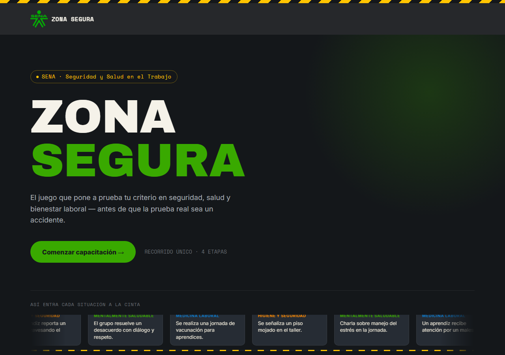
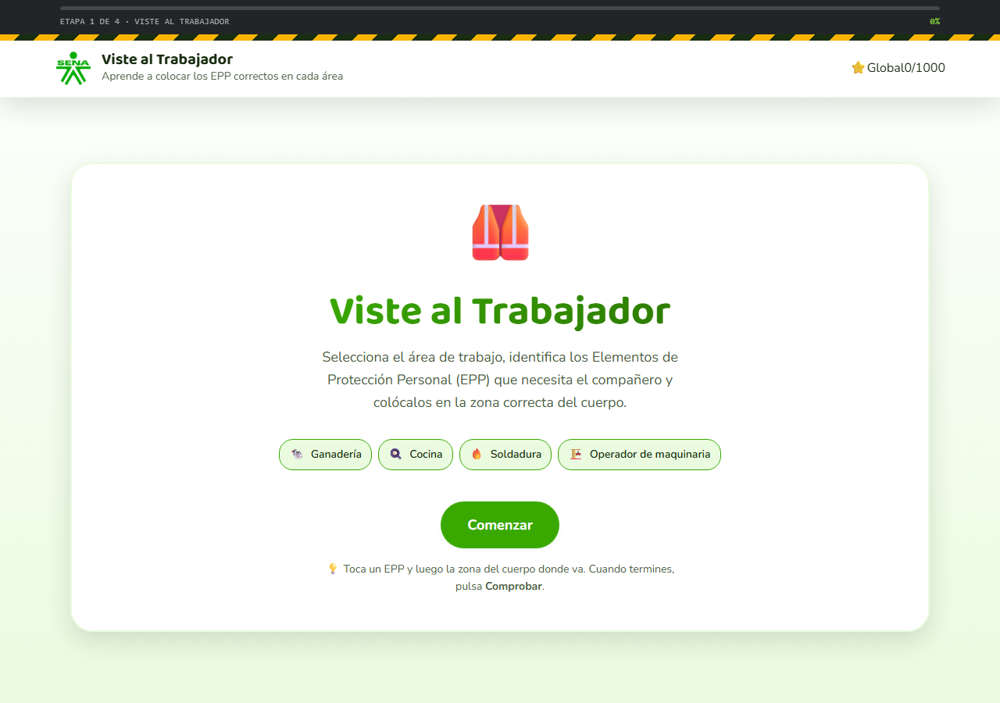
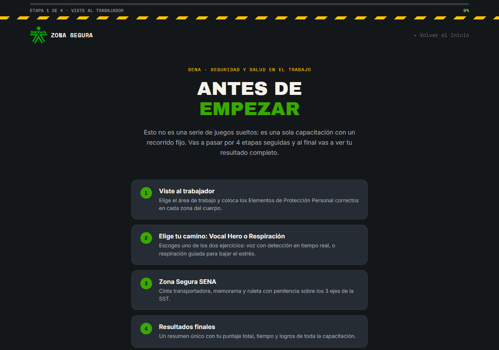
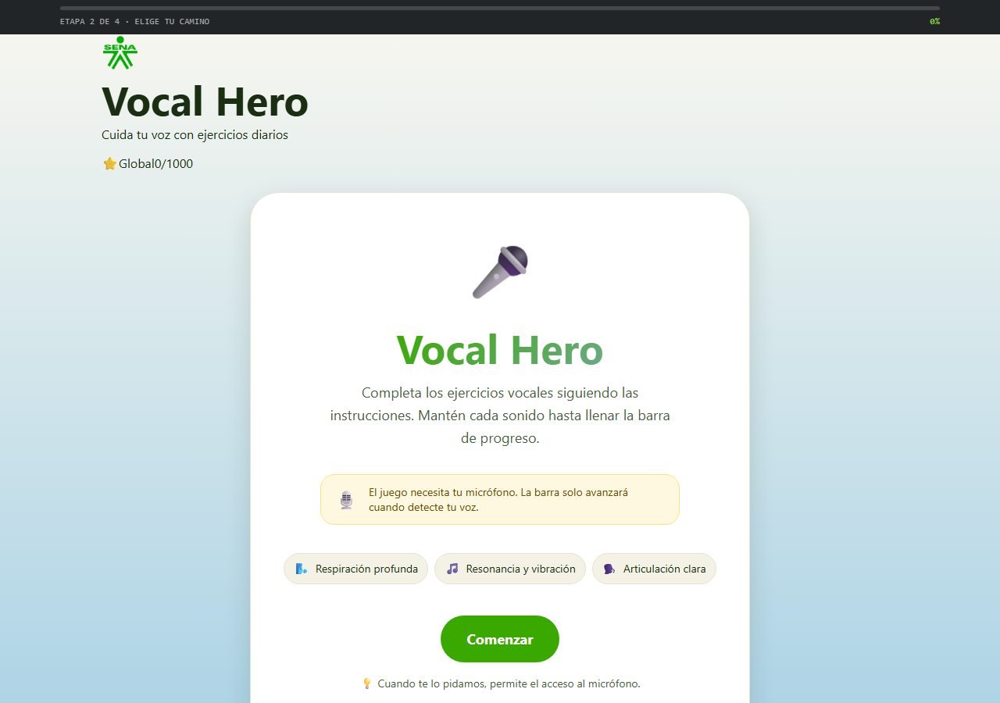
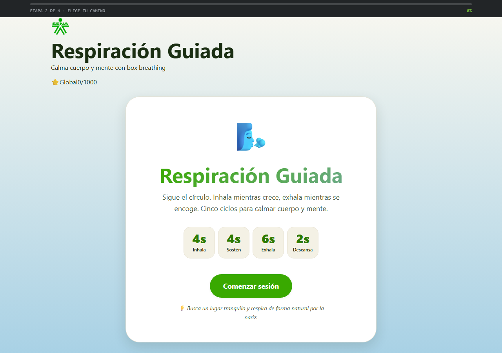

# 🎓 Zona Segura

Plataforma web de **minijuegos para el bienestar** y la **Seguridad y Salud en el Trabajo (SST)**. Contiene tres módulos activos:

- 🎓 **Zona Segura SENA**: 4 rondas interactivas sobre SST (cinta transportadora, memorama, ruleta, viste al trabajador con EPP).
- 🗣️ **Vocal Hero**: ejercicios vocales con detección de voz en tiempo real para cuidar las cuerdas vocales.
- 🌬️ **Respiración Guiada**: sesiones de box breathing 4-4-6-2 con visualización animada para reducir el estrés.

> Inspirado en el proyecto SENA CAFEC Casanare. Sistema de diseño híbrido: usa la paleta institucional SENA (verde `#39A900`, amarillo de peligro) manteniendo la limpieza y usabilidad de los módulos de bienestar.

---

<p align="center">
  <a href="https://juanezzzzz.github.io/zona-segura-sst/">
    
  </a>
</p>

## 📸 Capturas de pantalla

### 🏠 Menú principal



### 🎮 Los módulos y el recorrido

|  |  |
| :---: | :---: |
| 🦺 **Viste al Trabajador (EPP)** | 🎓 **Recorrido guiado de capacitación** |
|  |  |
| 🗣️ **Vocal Hero** | 🌬️ **Respiración Guiada** |
|  |  |

---

## 🚀 Cómo empezar

No requiere instalación ni build. Solo abre el archivo principal en cualquier navegador moderno:

1. Ve a la carpeta del proyecto.
2. Haz doble clic en `index.html` (o ábrelo con tu navegador: `Chrome`, `Edge`, `Firefox`).
3. Elige el módulo que quieras probar desde el menú.

> 💡 Algunas funciones (como el micrófono de Vocal Hero) requieren un **contexto seguro** (`https://` o `localhost`). Si abres los archivos directamente con `file://`, el navegador podría bloquear el permiso de micrófono. En ese caso, sirve un servidor local:
> ```bash
> python -m http.server 8000
> ```
> y entra a `http://localhost:8000`.

---

## 🗂️ Estructura del proyecto

```
zona segura/
├── index.html                          # Menú unificado (punto de entrada)
├── README.md
├── styles/
│   ├── global.css                      # Sistema de diseño híbrido (tokens SENA)
│   ├── global-progress.css             # Barra de progreso única del recorrido (Fase 2)
│   ├── vocal-hero.css                  # Estilos del módulo Vocal Hero
│   └── respiracion-guiada.css          # Estilos del módulo Respiración Guiada
├── scripts/
│   ├── global-progress.js              # Lógica del progreso único del recorrido (Fase 2)
│   ├── vocal-hero/
│   │   ├── exercises.js                # Catálogo de 10 ejercicios
│   │   ├── game.js                     # Motor: state machine + barra + cronómetro
│   │   ├── audio.js                    # Web Audio API (detección de voz con histéresis)
│   │   └── main.js                     # Bootstrap: conecta DOM con el motor
│   └── respiracion-guiada/
│       ├── patterns.js                 # Definición de la técnica Box 4-4-6-2
│       ├── game.js                     # Motor: animación del círculo + puntuación
│       └── main.js                     # Bootstrap
└── games/
    ├── vocal-hero.html                 # Página del módulo Vocal Hero
    ├── respiracion-guiada.html         # Página del módulo Respiración Guiada
    └── zona-segura-sena/               # Proyecto SENA completo (autocontenido)
        ├── index.html                  # SPA con 4 rondas + bienvenida + final
        ├── css/
        │   └── styles.css              # Estilos del SENA (autosuficiente)
        ├── js/
        │   ├── main.js                 # Lógica del juego
        │   ├── sound.js                # Efectos sintetizados
        │   └── vendor/
        │       ├── gsap.min.js
        │       └── MotionPathPlugin.min.js
        └── assets/
            ├── images/                 # 3 PNG de ejes + 1 SVG
            ├── sounds/                 # background-music.mp3
            └── LEEME_ASSETS.md
```

---

## 🎓 Zona Segura SENA

Juego educativo del **SENA CAFEC Casanare** sobre **Seguridad y Salud en el Trabajo (SST)**. Consta de 4 rondas interactivas con carnet de aprendiz al final.

### Las 4 rondas

| # | Ronda | Descripción |
|---|---|---|
| 1 | **Cinta transportadora** | Clasifica 8 situaciones en los 3 ejes de la SST. |
| 2 | **Memorama** | Empareja conceptos de higiene, medicina laboral y salud mental. |
| 3 | **Ruleta** | Gira la ruleta y responde preguntas con penitencia. |
| 4 | **Viste al trabajador** | Selecciona los Elementos de Protección Personal (EPP) correctos. |

### Pantalla de bienvenida

- Muestra el **carnet del aprendiz** y un formulario (nombre + rol).
- Botón de **inicio** para arrancar la primera ronda.
- Música de fondo opcional (se puede silenciar).

### Sistema de tokens independiente

El proyecto SENA tiene su propio `styles.css` con tokens propios (`--sena-green` etc.). **No** comparte `global.css` con el menú: cuando navegas a `games/zona-segura-sena/index.html`, solo carga su CSS interno. Esto evita colisiones y mantiene intacta la estética SENA original.

### Volver al menú

Desde la Fase 4, este módulo forma parte del recorrido único y **no** tiene ningún enlace ni logo que regrese al menú principal mientras está en curso. Al completar la última ronda, el botón "Ver resultados finales" continúa automáticamente a `../resultados.html`, que es la única pantalla del recorrido que ofrece salir o reiniciar.

---

## 🗣️ Vocal Hero

### Niveles incluidos (10 ejercicios)

| # | Nivel | Ejercicio | Duración |
|---|---|---|---|
| 1 | 1 · Vocales | Vocal A | 5 s |
| 2 | 1 · Vocales | Vocal E | 5 s |
| 3 | 1 · Vocales | Vocal I | 6 s |
| 4 | 1 · Vocales | Vocal O | 6 s |
| 5 | 1 · Vocales | Vocal U | 7 s |
| 6 | 2 · Resonancia | MMMMMM | 6 s |
| 7 | 3 · Respiración | Inhalar 4s + SSSSSS 6s | 10 s |
| 8 | 4 · Vibración | BRRRRRRRRR | 6 s |
| 9 | 5 · Articulación | MA - ME - MI - MO - MU | 5 s |
| 10 | 5 · Articulación | PA - TA - KA | 4.5 s |

### Detección de voz funcional

El micrófono está **siempre activo** (previa autorización del navegador). El motor del juego usa la Web Audio API para:

1. **Calibración inicial** (2 segundos): mide el ruido ambiente y establece un umbral adaptativo.
2. **Detección en tiempo real**: la barra de progreso **solo avanza** cuando el volumen RMS supera el umbral (voz detectada).
3. **Histéresis**: requiere 60 ms sostenidos de voz para activarse y 1500 ms de silencio para pausarse.
4. **Indicador VU**: barra de nivel visual en la pantalla de ejercicio.
5. **Aborto automático**: 30 segundos de silencio consecutivo → pantalla de reintento.
6. **Pausa visual**: el cronómetro se atenúa y la barra se detiene mientras no hay voz.

### Sistema de puntuación

- **+10** por ejercicio completado.
- **+20 bonus** por completar sin pausas.
- **+50 bonus** al terminar la rutina completa.
- **Mensaje motivacional** personalizado según el rango de puntuación.
- **Puntaje crudo máximo**: 350 (10 × 30 + 50 bonus). Se normaliza a 0-250 y se suma al puntaje global único (`GlobalScore.record('vocal', state.score)`); ya no existe una "mejor puntuación" individual persistida por separado.

### Atajos de teclado

- `Espacio` o `Enter`: iniciar / omitir éxito.

---

## 🌬️ Respiración Guiada

Sesión interactiva de **box breathing 4-4-6-2**: una técnica de respiración estructurada que combina fases de inhalación, sostén, exhalación y descanso.

### La técnica

| Fase | Duración | Acción |
|---|---|---|
| 🫁 Inhala | 4 s | Inhala lentamente por la nariz |
| ⏸ Sostén | 4 s | Mantén el aire en los pulmones |
| 💨 Exhala | 6 s | Exhala suavemente por la boca |
| 😌 Descansa | 2 s | Pausa breve antes de la siguiente inhalación |

Cada ciclo completo dura **16 segundos**. La sesión tiene **5 ciclos** → total de **~80 segundos**.

### Visualización

Un **círculo central con gradiente** se anima según la fase:

- 🟢 Crece de pequeño a grande durante la inhalación (curva `ease-out`).
- 🟣 Permanece en su tamaño máximo durante el sostén.
- 🔵 Se encoge de grande a pequeño durante la exhalación (curva `ease-in`).
- ⚪ Permanece pequeño durante la pausa.

El cronómetro dentro del círculo muestra los segundos restantes de cada fase, y el gradiente cambia de color para reforzar la sensación de cada momento.

### Sistema de puntuación

- **+10** por cada ciclo completado.
- **+20 bonus** al completar los 5 ciclos.
- **+50 bonus** al finalizar la sesión **sin usar la pausa**.
- **Calma estimada** (0-100%): combinación de puntuación y completitud.
- **Puntaje crudo máximo**: 120 (5 × 10 + 20 + 50 bonus). Se normaliza a 0-250 y se suma al puntaje global único (`GlobalScore.record('respiracion', state.score)`); ya no existe una "mejor puntuación" individual persistida por separado.

---

## 🎨 Sistema de diseño híbrido

Toda la paleta y los componentes viven en `styles/global.css` como **variables CSS** (custom properties). El sistema fusiona la identidad SENA con la paleta suave de bienestar.

| Token | Valor | Uso |
|---|---|---|
| `--color-primary` | `#39A900` | Verde SENA — botones, acentos principales |
| `--color-primary-dark` | `#2D7A00` | Hover, pressed |
| `--color-primary-light` | `#EAFBE0` | Fondos suaves, badges |
| `--color-accent` | `#FFB800` | Amarillo cálido SENA — CTAs secundarios, mejor puntuación |
| `--color-secondary` | `#8DC8A8` | Verde agua — progresos, éxito |
| `--color-blue` | `#5BA3C7` | Azul calmante — Vocal Hero |
| `--color-bg` | `#FAF8F0` | Papel cálido (SENA) — fondo de la app |
| `--color-text` | `#1A2E12` | Ink SENA — texto principal |
| `--shadow-md` | `0 8px 20px rgba(26, 46, 18, 0.10)` | Tarjetas |
| `--radius-lg` | `28px` | Radios generosos SENA |
| `--font-display` | `'Baloo 2'` | Títulos |
| `--font-body` | `'Nunito'` | Cuerpo de texto |

Componentes reutilizables disponibles:

- `.btn`, `.btn-primary`, `.btn-secondary`, `.btn-ghost`, `.btn-large`, `.btn-accent`
- `.card`, `.card-elevated`
- `.badge`, `.badge-success`, `.badge-warning`, `.badge-accent`, `.badge-info`
- `.progress-bar` + `.progress-bar-fill`
- `.hazard-rule` (franja amarilla-negra SENA)
- `.container`, `.screen`, `.section`
- `.fade-in`, `.pop-in` (animaciones)

### Estados suaves (alertas y tips)

Para mensajes contextuales (tips de éxito, advertencias de micrófono, errores de calibración) el sistema define variantes "soft":

- `--color-success-soft` / `--color-success-border` / `--color-success-ink`
- `--color-warning-soft` / `--color-warning-border` / `--color-warning-ink`
- `--color-danger-soft` / `--color-danger-border` / `--color-danger-ink`

---

## ➕ Cómo añadir un nuevo módulo al recorrido

Desde la Fase 1, la plataforma dejó de ser un menú de juegos independientes: ahora es un **recorrido único** (`introduccion.html → epp.html → elegir.html → [vocal-hero.html | respiracion-guiada.html] → zona-segura-sena/index.html → resultados.html`). Para añadir un módulo nuevo al recorrido:

1. Crea el archivo HTML del módulo en `games/<slug>.html` (o su propia carpeta). Incluye `styles/global.css`, `styles/global-progress.css` y un CSS propio si lo necesitas.
2. Márcalo con su etapa del recorrido: `<body data-progress-stage="<stage-id>">` y carga `scripts/global-progress.js` con `defer`.
3. Al completar el módulo, antes de navegar al siguiente: `ProgressTracker.complete('<stage-id>')` (o usa `data-progress-complete-on-load="<stage-id>"` si la etapa se completa solo con cargar la página, como `resultados.html`). Registra también la etapa en el array `STAGES` de `scripts/global-progress.js`.
4. Si el módulo tiene puntaje propio, carga `games/global-score.js` y al terminar llama `GlobalScore.record('<slug>', rawScore)`. Registra el módulo en `MODULES` dentro de `games/global-score.js`, con un `maxRaw` que sea el techo **real** calculado a partir de tu propia lógica de puntaje (revisa la fórmula con calculadora, no lo estimes a ojo — así se evitan los desbalances que se corrigieron en la Fase 3).
5. No agregues persistencia de "mejor puntaje" individual por módulo (`localStorage` con clave `<slug>-best-score`): desde la Fase 3 todo el puntaje vive en una sola variable global (`GlobalScore`), y las puntuaciones individuales por módulo se eliminaron a propósito.
6. Durante el recorrido no debe existir botón para volver al menú principal (Fase 4, Paso 4); solo `resultados.html` ofrece salir o reiniciar.

> 🏠 El botón **🏠 Home** del header quedó reservado para el estado previo al recorrido (o para revisar el resultado sin reiniciar); no debe usarse como "salida de emergencia" en medio de la capacitación.

> ⭐ El badge de `GlobalScore.mountBadge()` respeta la misma regla automáticamente: en cualquier página con `data-progress-stage` distinto de `resultados` se renderiza como un elemento informativo sin enlace (`global-badge--locked`), en vez de como un `<a>` hacia `index.html`. Si tu módulo nuevo carga `global-score.js`, no necesitas hacer nada extra para esto — pero evita añadir tu propio enlace manual al badge.

---

## 🛠️ Detalles técnicos

- **Sin dependencias externas** (en mis módulos): HTML + CSS + JS vanilla.
- **El módulo SENA** sí incluye GSAP local (`js/vendor/gsap.min.js`) — está autocontenido.
- **Sin build**: los archivos se sirven directamente.
- **Persistencia ligera**: `localStorage` para el estado del recorrido (Fases 2 y 3).
  - `zona-segura-progress` (`ProgressTracker`) — qué etapas del recorrido ya se completaron.
  - `zona-segura-global` (`GlobalScore`) — puntaje único acumulado (0-1000), normalizado por módulo.
  - `zonaSegura_historial` (SENA) — historial de participantes para el mini-leaderboard del módulo (nombre + puntaje de esa ronda); es un ranking de salón de clase, no un sistema de puntaje paralelo.
  - Ya **no** existen claves de "mejor puntaje" por módulo (`vocal-hero-best-score`, `respiracion-guiada-best-score`, `epp-best-score`): se eliminaron en la Fase 3 para que el único puntaje relevante sea el global.
- **Accesibilidad**: contraste AA, `aria-label`, `aria-live`, foco visible, soporte para `prefers-reduced-motion`.
- **Responsive**: mobile-first con breakpoints en 480px, 600px, 768px, 1024px.
- **Sin tracking**: nada de analytics, cookies ni servicios externos.

---

## ✨ Fase 7 · Pulido (versión candidata)

Última pasada de revisión antes de considerar el recorrido listo para probar con usuarios reales. Se revisaron los cuatro puntos del plan:

1. **Coherencia visual** — revisados los tokens de `styles/global.css` frente a los CSS de cada módulo; la separación de `zona-segura-sena/css/styles.css` es intencional (ver "Sistema de tokens independiente") y no se encontraron colores fuera de sistema que afecten la lectura de la interfaz.
2. **Textos y transiciones** — homologado el texto de los botones de continuar (`Continuar ahora →`) entre `epp.html`, `vocal-hero.html` y `respiracion-guiada.html`; corregida una sección del README (`Volver al menú` del módulo SENA) que describía un enlace de logo que ya no existe desde la Fase 4.
3. **Recorrido sin bloqueos** — se encontró y corrigió una fuga real: el badge `⭐ Global` (`games/global-score.js`) se inyectaba como enlace `<a href="../index.html">` en las páginas del recorrido (`epp.html`, `vocal-hero.html`, `respiracion-guiada.html`, `zona-segura-sena/index.html`), permitiendo salir de la capacitación a mitad de camino pese a la regla de la Fase 4, Paso 4. Ahora se renderiza como elemento informativo (`global-badge--locked`) mientras el recorrido está activo, y solo es un enlace real en `resultados.html`. También se cambiaron los dos botones "Volver al menú" de las pantallas de error de `vocal-hero.html` (sin permiso de micrófono / silencio prolongado): ahora llevan a `elegir.html` para permitir cambiar a Respiración Guiada, en vez de sacar a la persona del recorrido por completo.
4. **Pruebas** — verificada la sintaxis de todos los archivos `.js` del proyecto (`node --check`), revisado el balance de etiquetas HTML de cada página del recorrido, y confirmado que todas las imágenes referenciadas en `games/epp.js` (catálogo EPP y personajes por área) existen en `assets/images/epps/` y que los `id` usados en `correctos` de cada área coinciden con los del catálogo.

---

## 📜 Licencia

Uso libre para fines educativos y de bienestar personal.
